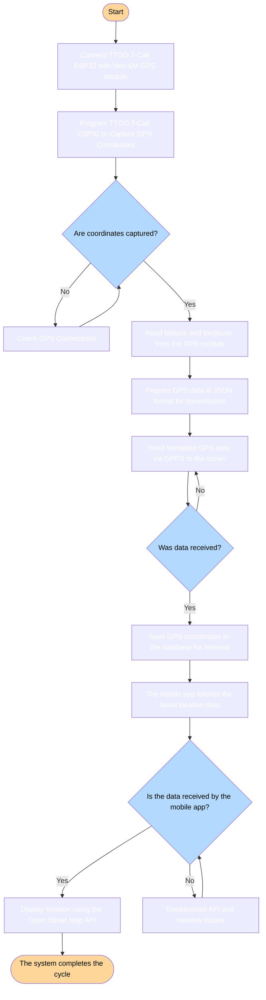
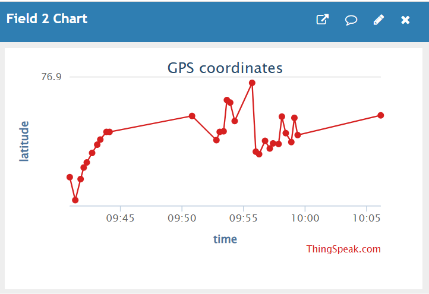

# 🚌 Real-Time Bus Tracking System

A comprehensive IoT-based real-time bus tracking solution that combines GPS, GSM, and cloud technologies to provide live location tracking for public transportation. Built with ESP32, Flutter, and modern web technologies.


[](https://flutter.dev)
[](https://www.espressif.com/)

---

## 📑 Table of Contents

- [Overview](#overview)
- [Features](#features)
- [Workflow](#Workflow)
- [Hardware Components](#hardware-components)
- [Software Stack](#software-stack)
- [Installation](#installation)
  - [Hardware Setup](#hardware-setup)
  - [Software Setup](#software-setup)
  - [Database](#database)
 
  

---

## 🎯 Overview

The **Real-Time Bus Tracking System** is designed to modernize public transportation by providing live tracking updates of buses directly to passengers' mobile phones. This project specifically targets the Himachal Road Transport Corporation (H.R.T.C.) buses but can be adapted for any public transport system.

### Key Objectives

- ✅ Provide real-time bus location tracking
- ✅ Reduce passenger waiting time uncertainty
- ✅ Improve public transportation efficiency
- ✅ Offer cost-effective hardware solutions
- ✅ Enable scalable cloud-based data management
- ✅ Create user-friendly mobile applications


---

## ✨ Features

### For Passengers
- 📍 **Real-time location tracking** on interactive maps
- ⏱️ **Estimated arrival times** at bus stops
- 🗺️ **Route visualization** with OpenStreetMap
- 📱 **Cross-platform mobile app** (Android/iOS)
- 🔔 **Push notifications** for bus updates
- 👤 **User authentication** and profile management

### For Administrators
- 📊 **Fleet management dashboard**
- 📈 **Historical data analytics**
- 🚨 **Real-time alerts** for delays/breakdowns
- 🛣️ **Route optimization insights**
- 👥 **Driver management system**
- 📉 **Performance monitoring**

### Technical Features
- 🌐 **GPRS-based data transmission**
- 🛰️ **GPS coordinate tracking**
- ☁️ **Cloud database storage** (Supabase)
- 🔄 **Real-time data synchronization**
- 🔋 **Power-efficient hardware design**
- 🔐 **Secure API communications**

---

## 🏗️ Workflow 
   


## System Description

This flowchart illustrates the complete GPS tracking system workflow from data capture to display:

### Components
- **Hardware**: TTGO T-Call ESP32 with Neo-6M GPS Module
- **Communication**: GPRS for data transmission
- **Storage**: Database for GPS coordinates
- **Display**: Mobile app with Open Street Map API

### Process Flow
1. System initialization and GPS module connection
2. GPS coordinate capture with error handling
3. Data formatting and transmission via GPRS
4. Database storage for persistence
5. Mobile app data retrieval and display
6. Error handling and troubleshooting
### Data Flow
1. **GPS Module** continuously captures latitude/longitude coordinates
2. **ESP32 Microcontroller** processes GPS data and formats it as JSON
3. **SIM800H GSM Module** transmits data via GPRS to the cloud
4. **Supabase Database** stores location data with timestamps
5. **Flutter Mobile App** fetches data and displays on OpenStreetMap
6. **Users** view real-time bus locations on their smartphones

---

## 🔧 Hardware Components

| Component | Model | Purpose | Specifications |
|-----------|-------|---------|----------------|
| **Microcontroller** | LilyGO T-Call SIM800H (ESP32 WROVER) | Data processing & GSM communication | Dual-core 240MHz, 520KB SRAM, Wi-Fi/BLE |
| **GPS Module** | Neo-6M | Location tracking | 50-channel, 2.5m accuracy, -162 dBm sensitivity |
| **Power Supply** | Rechargeable Li-ion Battery | Continuous operation | 5V regulated output |
| **Antenna** | GPS Ceramic Antenna | Signal reception | External antenna support |
| **Enclosure** | Weather-resistant casing | Component protection | IP65 rated (optional) |

### Hardware Features
- **ESP32 WROVER**: Dual-core processor with integrated Wi-Fi and Bluetooth
- **SIM800H GSM Module**: Quad-band 850/900/1800/1900 MHz support
- **Neo-6M GPS**: High sensitivity with external antenna capability
- **Power Management**: Low power consumption with deep sleep modes

---

## 💻 Software Stack

### Backend
- **Database**: [Supabase](https://supabase.com/) - PostgreSQL-based BaaS
- **IoT Platform**: [ThingSpeak](https://thingspeak.com/) - Data visualization
- **Programming**: Arduino C/C++ for ESP32 firmware

### Frontend
- **Framework**: [Flutter](https://flutter.dev/) 3.x - Cross-platform mobile app
- **State Management**: flutter_bloc 8.1.6
- **Maps**: flutter_map 7.0.2 with OpenStreetMap
- **Database Client**: supabase_flutter 2.8.1

### Development Tools
- **IDE**: Arduino IDE 2.x, Visual Studio Code
- **Version Control**: Git & GitHub
- **API Testing**: Postman

### Key Dependencies
```yaml
dependencies:
  flutter_bloc: ^8.1.6        # State management
  supabase_flutter: ^2.8.1    # Backend integration
  flutter_map: ^7.0.2         # Map rendering
  latlong2: ^0.9.1            # GPS calculations
  geolocator: ^13.0.2         # Device location
  equatable: ^2.0.6           # Value equality
```

---

## 📥 Installation

### Hardware Setup

#### Required Components
- LilyGO T-Call SIM800H (ESP32 WROVER) × 1
- Neo-6M GPS Module × 1
- SIM card with GPRS data plan
- 5V Rechargeable Battery


#### Wiring Diagram
```
ESP32 T-Call          Neo-6M GPS
─────────────         ──────────
GPIO 18       ───────► TX
GPIO 19       ◄─────── RX
3.3V          ───────► VCC
GND           ───────► GND
```

#### Circuit Connections

| ESP32 Pin | Neo-6M Pin | 
|-----------|------------|
| GPIO 18   | TX         | 
| GPIO 19   | RX         | 
| 3.3V      | VCC        | 
| GND       | GND        | 

**Note**: The SIM800H module is integrated into the LilyGO T-Call board.

#### Assembly Steps

1. **Mount GPS Module**: Secure the Neo-6M GPS module with clear sky visibility
2. **Connect Wiring**: Follow the wiring diagram above
3. **Insert SIM Card**: Place an active SIM card with GPRS enabled into the SIM800H slot
4. **Power Connection**: Connect the rechargeable battery to the power input
5. **Enclosure**: Place components in weather-resistant housing (if outdoor use)
6. **Antenna Positioning**: Ensure GPS antenna has unobstructed view of the sky


**Circuit diagram**

**Physical device**
### Software Setup

#### Prerequisites
- Arduino IDE 2.0 or higher
- Flutter SDK 3.0 or higher
- Git installed
- Supabase account
- ThingSpeak account (for visualization)


**Install Required Arduino Libraries:**
- TinyGSM
- TinyGPSPlus
- HardwareSerial
- Wire

## Database 

**Real-time data on ThingSpeak** 



**Supabase Schema:**


## App User interface:


